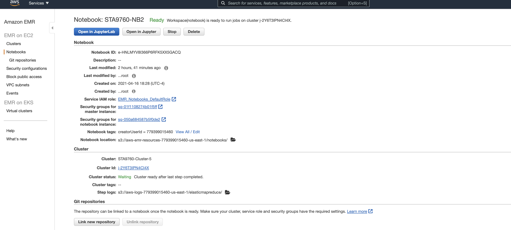
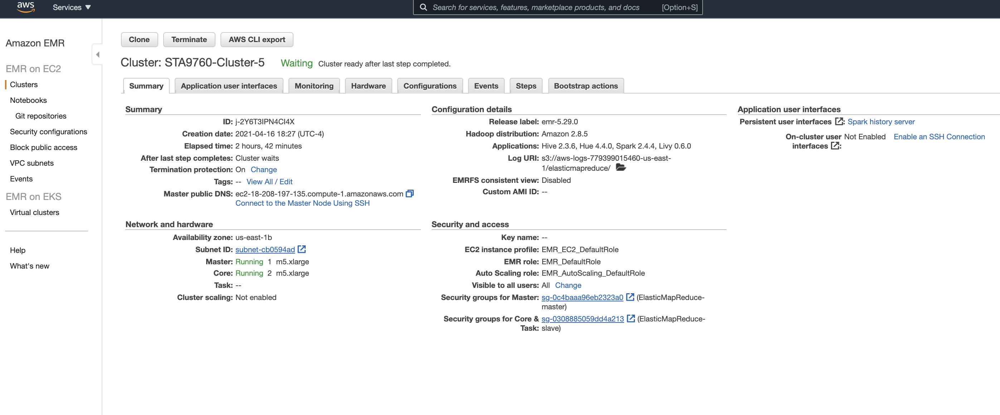

# Analyzing 10Gb of Yelp Reviews Data

We will analyze a subset of Yelp's business, reviews and user data. This dataset comes to us from [Kaggle](https://www.kaggle.com/yelp-dataset/yelp-dataset) although we have taken steps to pull this data into a publis s3 bucket: `s3://sta9760-yelpdataset/yelp-light/*business.json`  
We used Apache Spark technology with PySpark Python library. A Spark Cluster should be created and run on AWS EMR as well as Jupyter Notebook similar to the pictures.

## [Analysis](https://github.com/behzad00/project02/blob/main/Analysis.ipynb)

# Cluster Configuration

